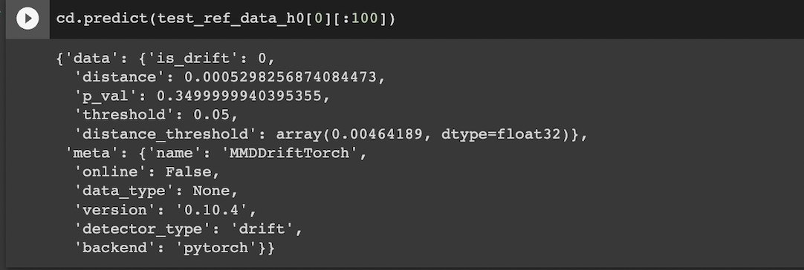

# Data Drift

3 albumentations were used - 
  - A.ShiftScaleRotate(shift_limit=0.05, scale_limit=0.05, rotate_limit=15, p=0.5),
  - A.RGBShift(r_shift_limit=15, g_shift_limit=15, b_shift_limit=15, p=0.5),
  - A.RandomBrightnessContrast(p=0.5),
 
 ## Logs to check for Drift
 
 
 
 
 
 
 
 ## Tensorboard Logs - Model training with Augmentations
 
 
 
 
 
 
 
  ## Refined Model vs Original Model Prediction
  
   
   
  Drift detected and original model giving different predictions since it was not trained on augmented data.
  
   
    
  Drift detected but this time, refined model giving same predictions since it was trained on augmented data.
